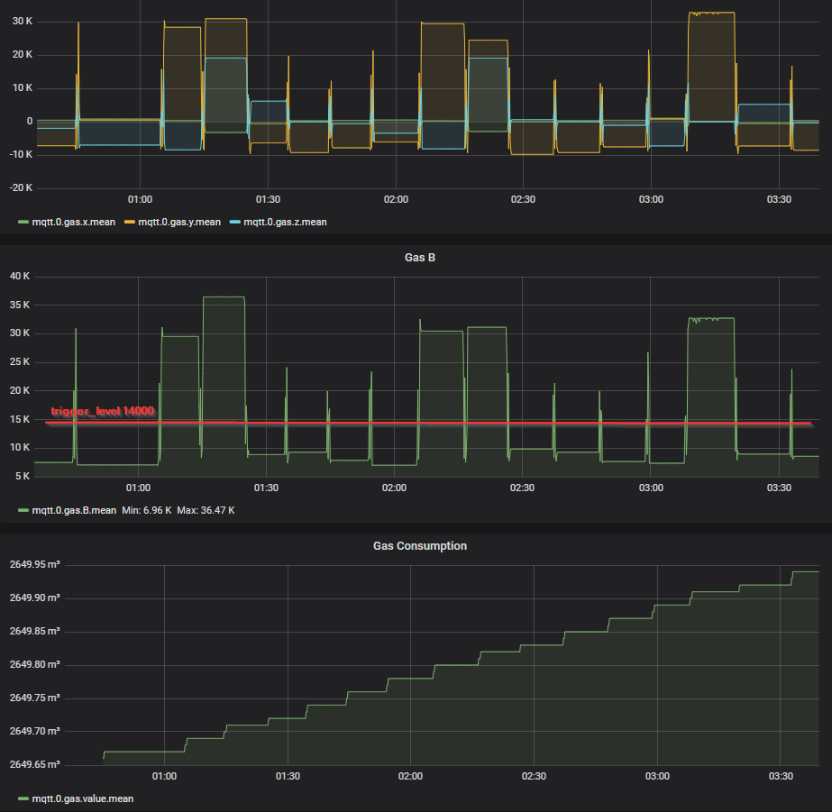

# qmc5883-gas-meter
Read the gas consumption with a QMC5883 magnetometer via I2C or USB and send it to a MQTT broker like ioBroker

HMC5883 Sensors are not easy to get, but QMC5883 are. Therfor here is a library to read the gas meter (i have a BK G4) and send the values to ioBroker (MQTT Adapter).

# Prerequisites
- Gas counter with rotating magnet
- Digital magnetometer QMC5883 (on breakout board)
- Raspberry/Arduino OR I2C/USB Adapter like me (CH341 USB)

# qmc5883.py
- Reads basic values via I2C Interface from QMC5883 device
  - values of 3 axis (x, y, z) as int16
  - calculate the magnetic field (B-Field) 
- Sets the trigger value if the B-Field reaches the trigger_level

# iobroker-client.py
- initializes the connection to an mqtt broker
- uses the qmc5883.py to read values and send to mqtt
- stores and increments the total gas count

# Setup
- Attach the magnetometer on your gas meter
- setup the I2C connection [CH341 I2C/USB driver](https://github.com/gschorcht/i2c-ch341-usb)
- configure constants of iobroker-client.py
- keep the program running and find the trigger_level for your setup

# Grafana

# ioBroker

#Inspired and credits:

- http://www.kompf.de/tech/gascountmag.html
- https://github.com/hacki11/qmc5883-gas-meter
- https://github.com/keepworking/Mecha_QMC5883L

